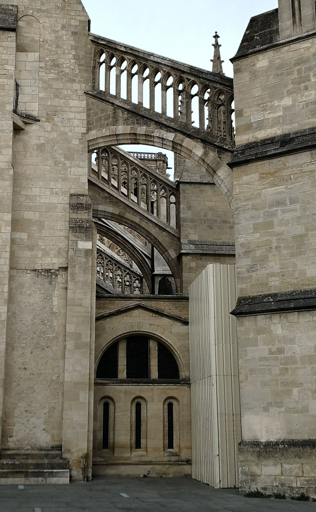
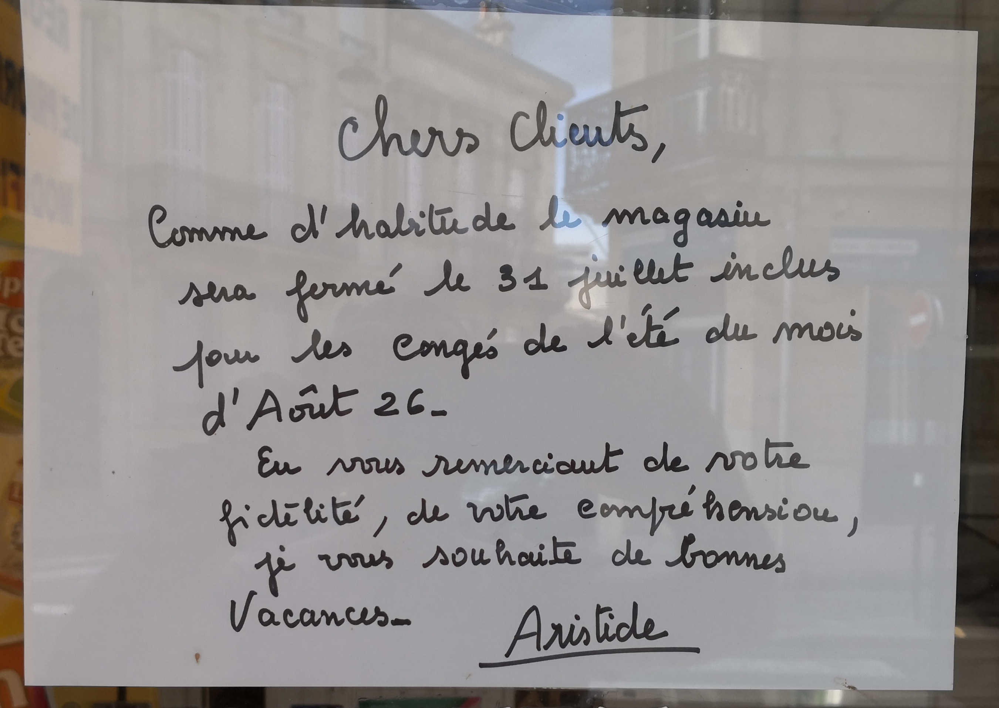

+++
title="Vides"
id=15
date=2026-10-04

[extra]
local_post_image="peyberland.jpg"

[taxonomies]
tags=["weekly"]
+++

C'est une très vieille idée. Le vide, l'absence, donnent leurs structures aux formes et aux pensées.

<!-- more -->

Des nuages gris, la lumière est douce. Il n'y a pas de bruit  
Juste de temps en temps, au loin, un son étouffé, une voiture comme une vague s'effondrant sur le sable

Mon boulanger ne revient pas. Sur l'absence se greffent au fil des jours les interrogations inquiètes.
