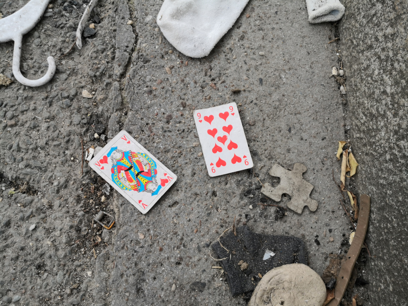
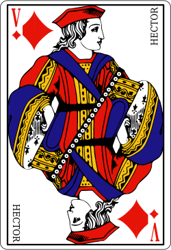
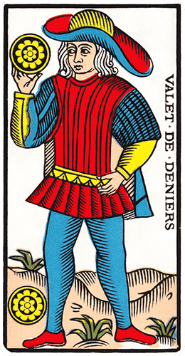

+++
title="Bonne aventure"
id=8
date=2021-08-15

[taxonomies]
tags=["personnel", "tarot"]
+++

J'ai rencontré un valet et un neuf de coeur sur la route. Ce qui semble être de bon augure selon les manuels de cartomancie.

Cela m'a surtout rappelé une une trouvaille similaire, un jour de juin 1996, à Nantes (consacrée ville surréaliste par André Breton) et dûment notée dans mon journal de l'époque :

<!-- more -->

> Fin d’après-midi, il est temps de retourner à Notre Dame de Monts; je m’apprête
> à ouvrir la portière de ma petite auto lorsque mon attention est attirée par un
> objet tombé près de la roue arriére droite. C’est une carte à jouer, figure contre
> le sol. Je la ramasse, la retourne et Hector, valet de carreau, me présente ses
> deux profils tête-bêche.

Le valet de carreau des cartes usuelles correspond au valet de deniers dans le tarot de Marseille. J'avais aimé le fait d'être tombé sur cette carte un peu excentrique : contrairement aux autres figures son nom est inscrit verticalement, et l'emblème de sa famille -le denier- est représenté deux fois au lieu d’une.

