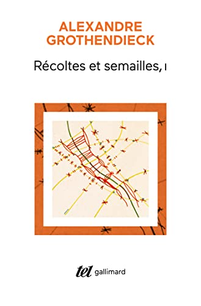
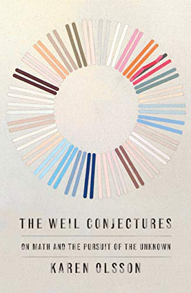
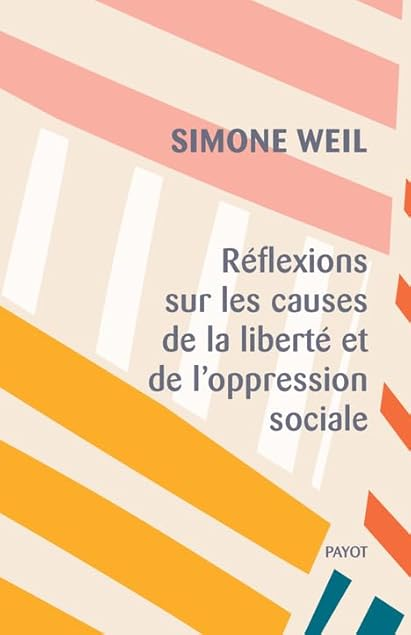

+++
title="Comment j'ai lu Simone Weil à cause d'une batterie défaillante"
id=12
date=2024-09-03
tags=["philosophie", "mathematiques", "lu", "voyage", "Grothendieck"]
+++

J'ai improvisé un voyage dans le nord de l'Europe cet été. Pour occuper les longues sessions de train, j'avais emporté ma liseuse électronique ainsi qu'un "vrai" livre papier de secours, suffisamment épais. Bien m'en a pris : la batterie de mon vieux Kindle s'est épuisée au bout de 3 jours, alors que Jean Valjean et Cosette, essayant d'échapper à Javert et ses sbires dans des ruelles d'un Paris nocturne, se retrouvaient coincés dans un cul de sac.

Je débute donc la lecture du premier volume de _Récoltes et Semailles_, qui attendait depuis au moins deux ans dans ma pile de livres _à lire_. Mon intérêt pour ce livre de mémoires d'Alexandre Grothendieck avait été renouvelé par la série de podcasts proposée début août par france culture [Alexandre Grothendieck, légende rebelle des mathématiques](https://www.radiofrance.fr/franceculture/podcasts/serie-alexandre-grothendieck-legende-rebelle-des-mathematiques).

Le lendemain je visite une librairie de Stokholm qui met en avant un livre dont le titre attire mon attention : _The Weil Conjectures_ de Karen Olsson, ces mêmes conjectures de Weil dont je venait d'apprendre le rôle fondamental dans les travaux de Grothendieck ! (et l'épisode synchronistique se prolongera avec [un article du Guardian consacré à Grothendieck](https://www.theguardian.com/science/article/2024/aug/31/alexander-grothendieck-huawei-ai-artificial-intelligence) publié le jour suivant...).

Karen Olsson revient sur la vie et l'oeuvre de André Weil, l'immense mathématicien auteur des conjectures, et de sa soeur Simone Weil philosophe exaltée, morte à 34 ans. J'ai avalé en deux jours son livre passionnant, émouvant, qui m'a convaincu d'essayer de lire l'oeuvre de Simone Weil, alors que l'aspect mystique de celle-ci m'avait rebuté jusqu'alors. Je me suis procuré _Réflexions sur les cause de la liberté et de l'oppression sociale_ dès mon retour en France.

Je n'y ai pas vu de mysticisme (apparaît-il dans ses livres ultérieurs ?), mais au contraire une observation lucide du monde et une impressionnante rigueur intellectuelle, dans une écriture simple aux arguments qui m'ont parus sans faille. Cela rend ce petit livre beau et effectivement fondamental, malgré la tristesse qui m'a pris en lisant les implacables analyses que Simone fait du fonctionnement de notre société.

> Toute espèce de vertu a sa source dans la rencontre qui heurte la pensée humaine à une matière sans indulgence et sans perfidie. On ne peut rien concevoir de plus grand pour l'homme qu'un sort qui le mette directement aux prises avec la nécessité nue, sans qu'il n'ait rien à atttendre que de soi, et tel que sa vie soit une perpétuelle création de lui-même par lui-même.
