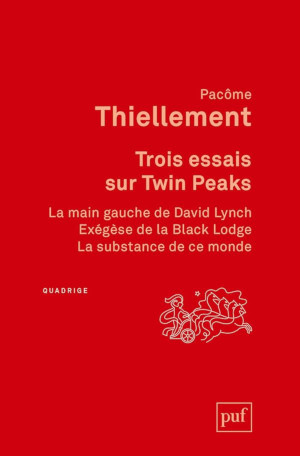
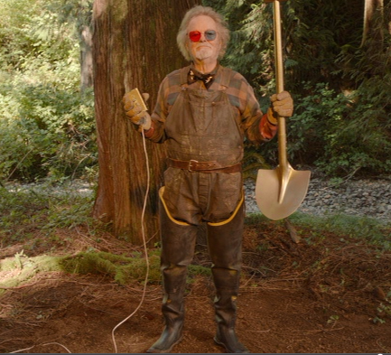
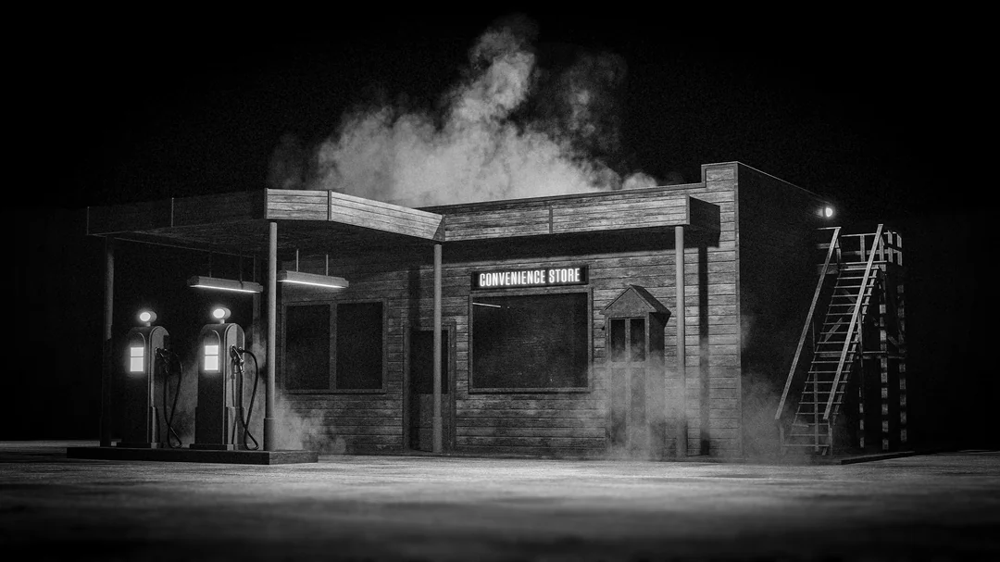

+++
title="Électricité"
id=15
draft=false
date=2026-09-27T15:00:00+02:00

[extra]
local_post_image="gazStationTwinPeaks_thumbnail.webp"

[taxonomies]
tags=["lectures", "TwinPeaks", "David Lynch", "weekly"]
+++

J'arrive au terme de l'ultime saison de Twin Peaks. Mais je n'en ai pas fini pour autant avec son univers.

<!-- more -->

Cette semaine j'ai débuté la lecture de The secret history of Twin Peaks, de Mark Frost co-scénariste de la série. Et j'ai acheté _3 essais sur Twin Peaks_ de Pacôme Thiellement. Immergé dans cet univers, je commence à en voir des reflets un peu partout.

Hier, en revenant de chez Mollat avec le Pacôme Thiellement (et le Décameron de Boccace), je suis passé par l'esplanade Charles de Gaulle. Un jeune homme torse nu arborant un collier de chaines dorées, pulvérisait méticuleusement à la bombe de la peinture dorée sur sa trottinette, en plusieurs couches, dans les moindres recoins, de la même manière que le Dr Jacobi recouvrait ses pelles qu'il revendait sur internet, in order to "dig yourself out of the shit" dans la 3ème saison de Twin Peaks.

J'écrivais sur un banc non loin, face à des pins immobiles sur lesquels arrivait une lumière vibrante, rendue électrique par les réfractions des rayons rasants de fin d'après-midi à travers les gerbes du jet d'eau qui s'interposait entre le soleil et les ramures que j'observais. Effets électriques qui se manifestent autour des passages entre monde "réel" et loges de Twin Peaks.



