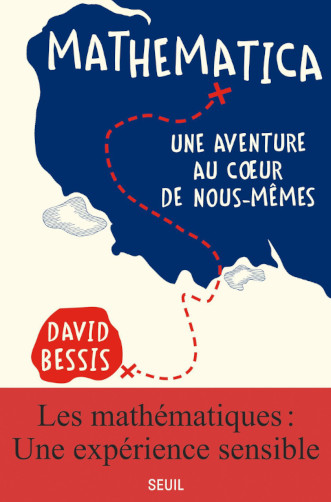

+++
title="Mathematica"
id=10
date=2023-05-14
tags=["mathématiques", "lu", "Grothendieck"]
+++

Il y a un peu plus d'un an, début avril 2022, je passais quelques jours à Paris.

J'ai visité la librairie Yvon Lambert, et acheté un exemplaire soldé de _Jacques Roubaud médiéviste_ (excellent) et, sous les arguments du vendeur, un poème de Jacques Roubaud publié une semaine auparavant sous la forme d'une simple page A4.

<!-- more -->

J'ai attendu la soirée pour me rendre à la librairie/bar _La Belle Hortense_, deuxième étape de cette ballade placée sous le signe de mon Oulipien préféré (_La Belle Hortense_ est le titre d'un roman de Jacques Roubaud), car j'avais appris qu'y était programmée une rencontre avec David Bessis autour de son son livre Mathematica.

Arrivé quelques minutes avant l'heure, je me suis installé non loin du bar où étaient déjà accoudés l'auteur et des amis à lui, et j'ai commandé un verre de vin, pour me donner contenance et patienter. Nous avons patienté collectivement, mais les gens ne sont pas venus. Je n'osais pas me manifester, je restais à boire doucement mon verre, en écoutant David Bessis et ses amis qui essayaient de combattre leur déception de ne voir personne arriver.

Deux jeunes filles que je n'avais pas remarquées, peut-être japonaises, sont sorties et ont pris la facade en photo, l'une avait un totbag _Yvon Lambert_.

J'ai attendu la sortie de _Mathematica_ en poche, en mars de cette année, pour finalement l'acheter. Je l'ai beaucoup aimé.

David Bessis essaie d'identifier les processus de pensée des mathématiciens. Il reprend les codes du livre de développement personnel (de façon parfois un peu lourde il est vrai) pour nous livrer son idée centrale : le but des mathématiciens est de développer une intuition des divers objets mathématiques, qu'il assimile au _systeme 1_ de Kahneman, en utilisant la rigueur des démonstrations logiques des mathématiques qu'il voit comme un _systeme 3_, plus lent encore que le _systeme 2_ de Kahneman mais permettant d'identifier les erreurs du _systeme 1_ et de l'affiner.

C'est aussi pour lui le prétexte de nombreuses anecdotes autour de la vie de grands mathématiciens (Descartes, Grothendieck, Gauss,...) ou d'initiation à quelques domaines mathématiques fascinants, comme la quatrième dimension dont l'étude allait occuper une bonne part de mon temps libre les semaines suivantes.
