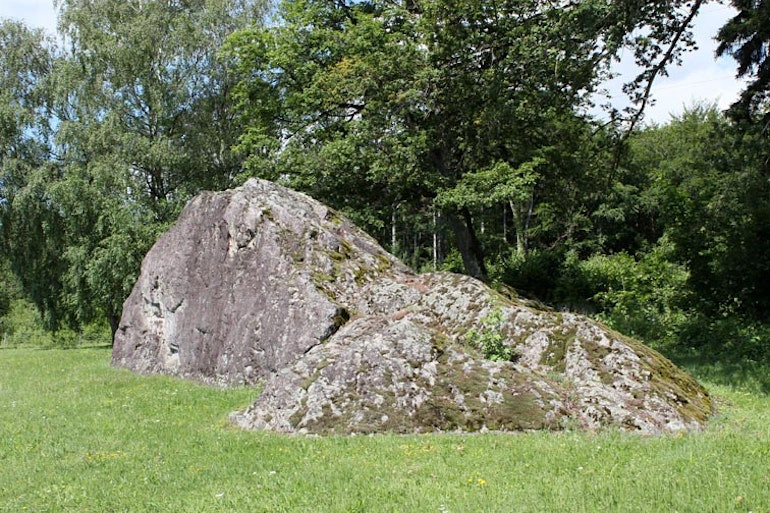

+++
title="Pierre Féline"
id=12
draft=false
date=2025-02-17
tags=[]
+++

À la fin de _Poésie Perdue_ de Paul Valéry, la chronologie nous révèle que celui-ci a été initié aux Mathématiques par son ami Pierre Féline. L'oxymore poétique de ce nom m'émerveille.

Je n'ai pas appris grand chose sur Pierre Féline en recherchant sur le web, mais j'ai découvert un lieu-dit en Suisse, près d'une aire d'autoroute, avec [des blocs erratiques](https://www.visinand.ch/Blocs_erratiques/Vaud/Crans-Pierre_Feline/Crans-Pierre_Feline.htm), roches amenées là "à dos de glacier".

