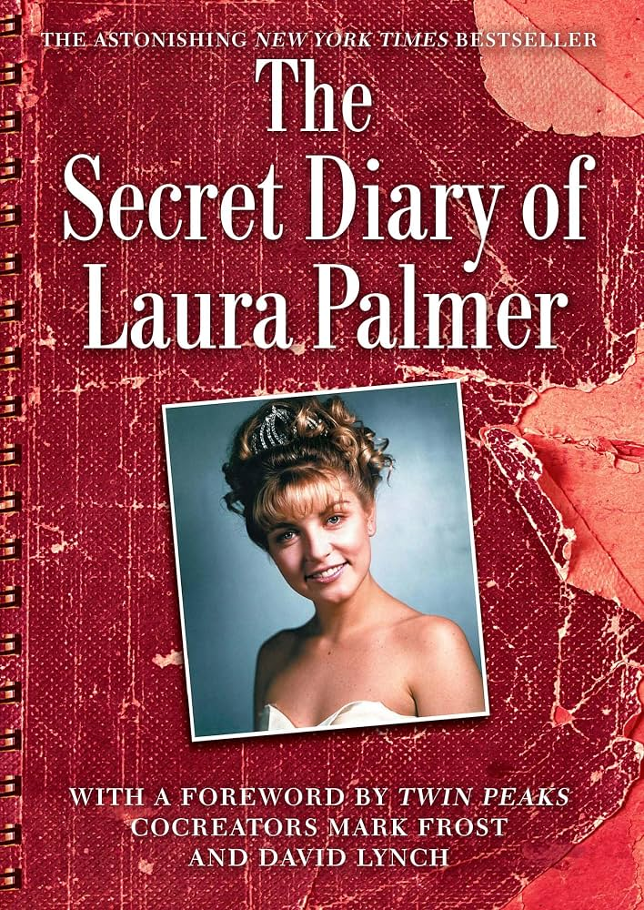

+++
title="Journaux intimes"
id=14
draft=false
date=2026-09-19T10:02:00+02:00

[extra]
local_post_image="secretDiaryOfLauraPalmer_thumbnail.jpg"

[taxonomies]
tags=["lectures", "TwinPeaks", "David Lynch", "weekly"]
+++

Cette semaine j'ai lu _The secret diary of Laura Palmer_ de Jennifer Lynch, pour accompagner mon re-visionnage de l'ensemble des épisodes de Twin Peaks (merci [arte.tv](https://www.arte.tv/fr/videos/RC-027513/twin-peaks/)).

<!-- more -->

Je n'avais pas regardé la série depuis sa diffusion initiale, début des années 90 pour les deux premières saisons, 2017 pour la troisième. J'avais adoré la 3ème saison bien que j'avais un souvenir très flou des deux premières.

Maintenant que j'enchaine tous les épisodes, à raison de un ou deux par jour, les morceaux se recollent beaucoup mieux (d'autant que je j'écoute parallèlement un podcast, _Diane_, discussions autour de chaque épisode) et le plaisir est décuplé.

Autre plaisir, le retour de mes oncles et tantes à qui j'ai envoyé le livre des _Cahiers de Mamy Rose_.
Depuis deux ans je scanne et retranscris les cahiers hérités de ma grand-mère, ensemble de mémoires, de poésies et journal quotidien adressé à ses enfants. J'en ai fait une édition pour ses 8 enfants encore vivants, regroupant le premier tiers des cahiers, totalisant près de 800 pages, la limite acceptée par le service d'impression Lulu.

Ce fut l'occasion de prendre des nouvelles de chacun et chacune. C'est ainsi que j'ai appris qu'une petite cousine chante dans un groupe sympa du côté de Salamanque, Estrés. Ça m'a donné envie de me remettre à la guitare, je ne sais pas combien de temps ça va durer.


