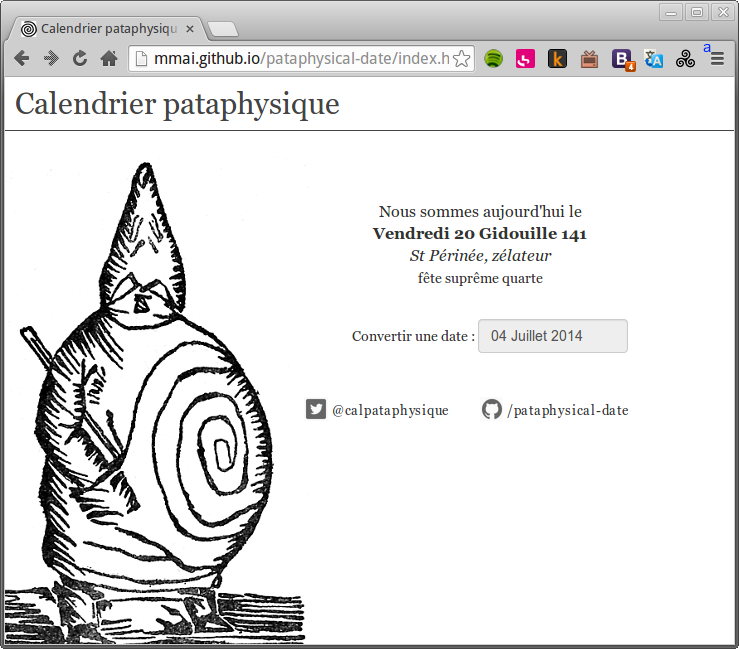
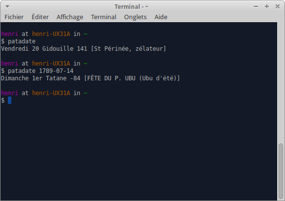
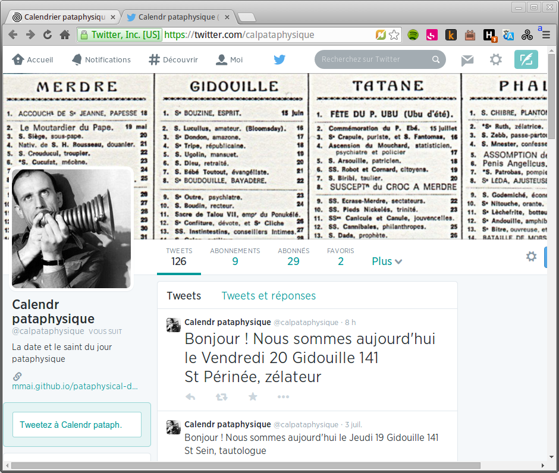

+++
title = "Calendrier pataphysique"
description = "Convertit des dates du calendrier usuel vers le calendrier pataphysique"
weight = 40
template = "page.html"

[taxonomies]
tags = ["pataphysics", "javascript", "api", "cli"]

[extra]
local_image = "img/projects/pataphysical-date-thumbnail.png"
+++

Une bibliothèque javascript, un robot twitter (maintenant défunt), et une [application web](http://mmai.github.io/pataphysical-date/) de conversion des dates du calendrier usuel vers le calendrier pataphysique.

Le code de la bibliothèque est disponible sur <https://github.com/mmai/pataphysical-date>

La bibliothèque peut être utilisée directement dans le navigateur, ou dans node en tant que module NPM.

Le module NPM contient un script executable en ligne de commande et permet d'afficher la date pataphysique depuis un terminal.

C'est le script qu'utilisait le twitter bot @catalpataphysique pour twitter quotidiennement la date et le saint du jour.

