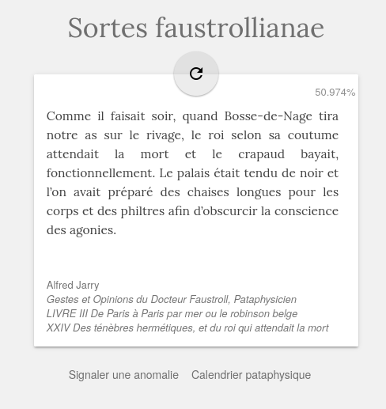

+++
title = "Sortes Faustrollianae"
description = "Une application web de bibliomancie pataphysique sur les *Gestes et opinions du docteur Faustroll* d'Alfred Jarry"
weight = 50
template = "page.html"

[taxonomies]
tags = ["cyclejs"]

[extra]
local_image = "img/projects/faustrollianae-thumbnail.png"
+++

Une [application web de bibliomancie pataphysique](http://mmai.github.io/faustrollianae/) sur les _Gestes et opinions du docteur Faustroll_ d'Alfred Jarry.

Sources sur <https://github.com/mmai/faustrollianae>
