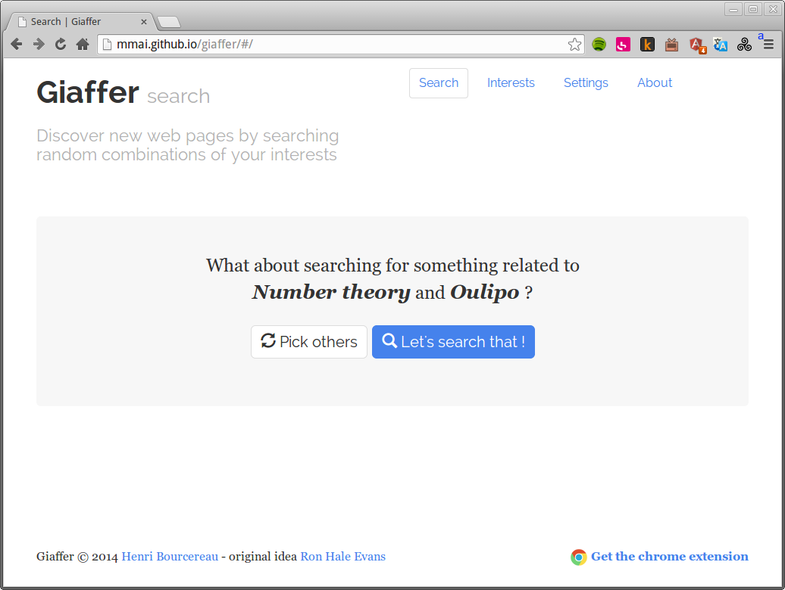
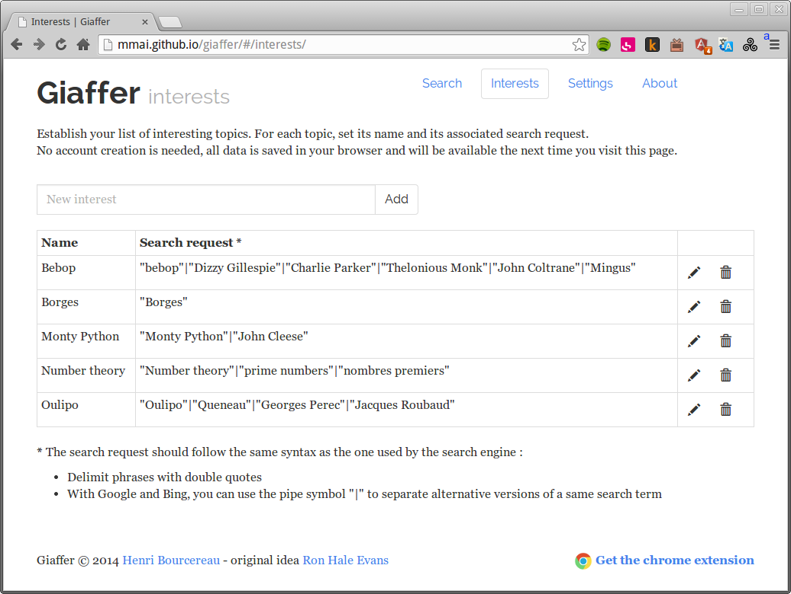

+++
title = "Giaffer"
description = "Générateur de sérendipité web"
weight = 30
template = "page.html"

[taxonomies]
tags = ["angular"]

[extra]
local_image = "img/projects/giaffer-thumbnail.png"

+++

Générateur de sérendipité web : [application web](http://mmai.github.io/giaffer/) et extension Chrome permettant de construire aléatoirement une requête pour moteurs de recherche à partir d'une liste d'intérêts personnels. D'après une idée de Ron Hale Evans.

