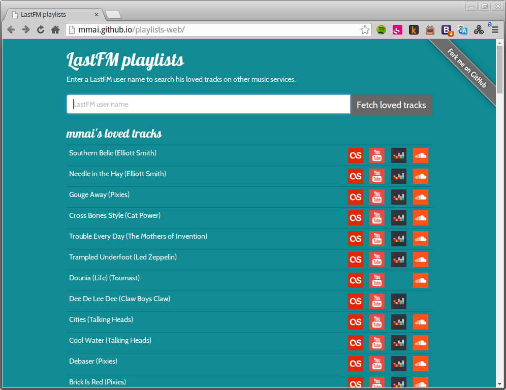
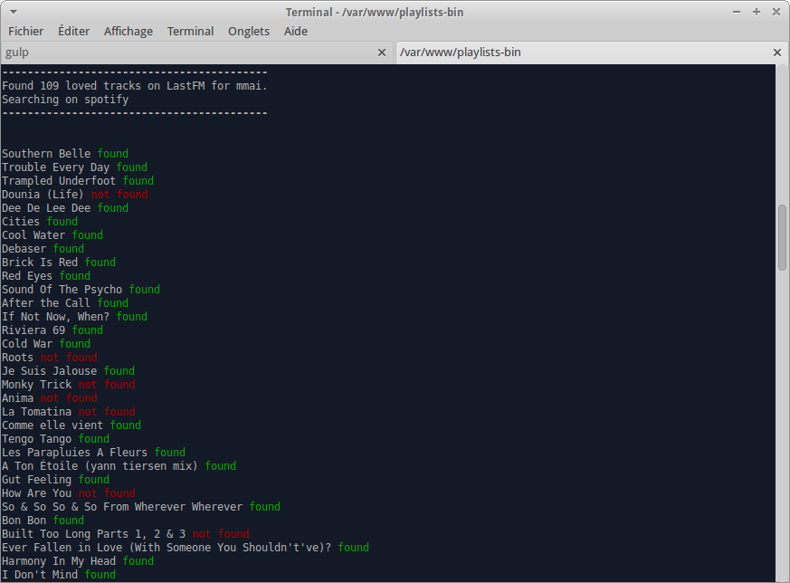

+++
title = "LastFM playlists"
description = "Recherche les morceaux favoris d'un utilisateur LastFM sur d'autres services de streaming"
weight = 100
template = "page.html"

[taxonomies]
tags = ["react", "javascript"]

[extra]
local_image = "img/projects/lastfm-playlists-thumbnail.png"

+++

[Application web](http://mmai.github.io/playlists-web/) de recherche des morceaux favoris d'un utilisateur LastFM sur d'autres services musicaux.

Version ligne de commande (avec plus de services): [mmai/playlists-bin](https://github.com/mmai/playlists-bin.git).

Les deux déclinaisons utilisent une bibliothèque modulaire d'interrogation des API : [mmai/playlists](https://github.com/mmai/playlists)
