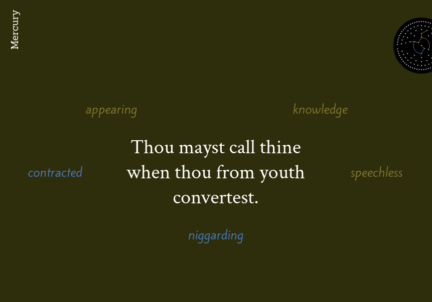
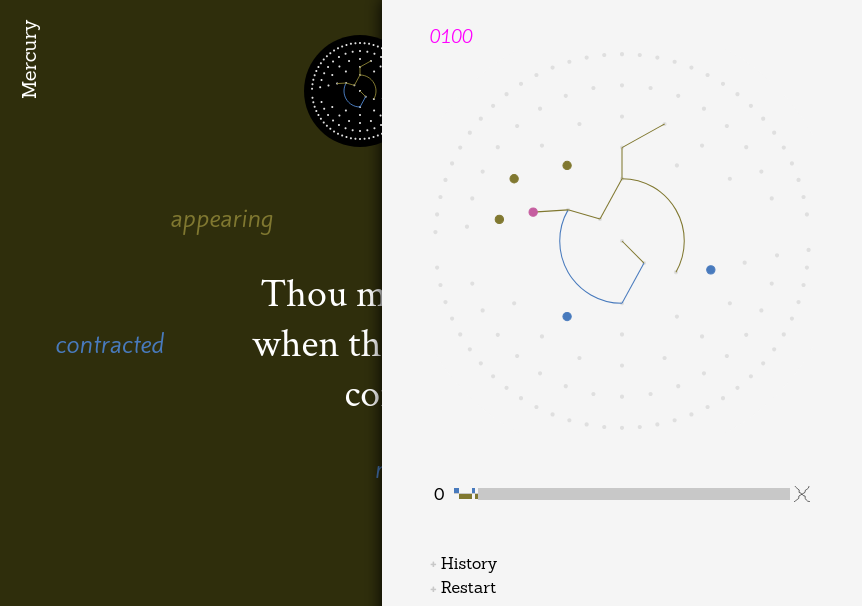

+++
title = "Poemaze"
description = "Interface d'exploration et visualisation dynamique d'un poème restructuré en graphe"
weight = 30
template = "page.html"

[taxonomies]
tags = ["cyclejs"]

[extra]
local_image = "img/projects/poemaze-thumbnail.png"

+++

[Interface d'exploration](https://mmai.github.io/poemaze/) et visualisation dynamique d'un poème restructuré en graphe.

Sources : <https://github.com/mmai/poemaze>
