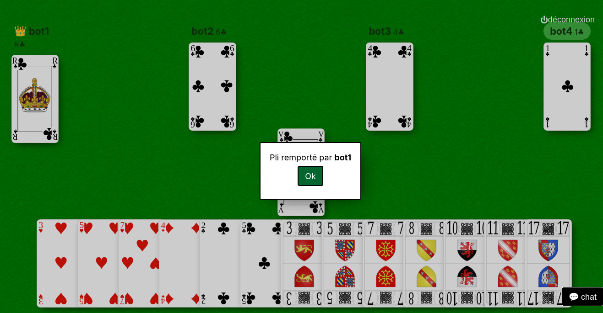

+++
title = "Webtarot"
description = "Un jeu de tarot multijoueurs en ligne avec bots. Rust / webassembly"
weight = 5
template = "page.html"

[taxonomies]
tags = ["rust", "webassembly", "nix", "jeux"]

[extra]
local_image = "img/projects/webtarot-thumbnail.png"

+++

Un jeu de tarot multijoueurs en ligne avec bots. Rust / webassembly.

Sources : <https://github.com/mmai/webtarot>
